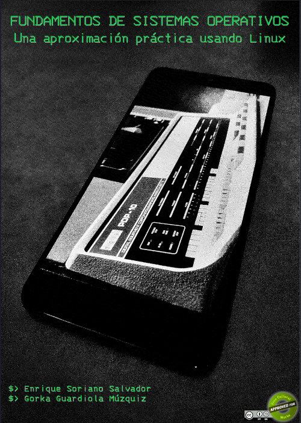

<meta name="description" content="libro linux gratis libre creative commons pdf GNU shell sistemas operativos procesos memoria ficheros concurrencia ipc bash C">

# Fundamentos de Sistemas Operativos: Una Aproximación Práctica usando Linux

Bienvenido a la página principal del libro
*Fundamentos de Sistemas Operativos: Una Aproximación Práctica usando Linux*.

Este libro es **libre y gratuito**,
se distribuye bajo una licencia `Atribución-CompartirIgual 4.0 Internacional`
de Creative Commons, disponible en [https://creativecommons.org/licenses/by-sa/4.0/deed.es](https://creativecommons.org/licenses/by-sa/4.0/deed.es).

Este es un libro de sistemas operativos, centrado en sistemas GNU/Linux.
Lo empezamos a escribir durante el primer
confinamiento causado por la pandemia COVID-19, como parte del material online para
dar soporte a nuestros alumnos de Ingeniería Telemática/Telecomunicaciones e
Ingeniería Robótica Software. Como tal, es un libro eminentemente práctico (usando el lenguaje de programación C), aunque
hay capítulos que incluyen conceptos más teóricos.

Los ejemplos se han probado en Linux (específicamente, en una distribución Ubuntu), pero en principio
deberían ser fáciles de trasladar a cualquier sistema tipo Unix.

**Descarga el [PDF](https://github.com/honecomp/honecomp.github.io/raw/main/books/librossoo.pdf).**

<a href="https://github.com/honecomp/honecomp.github.io/raw/main/books/librossoo.pdf">
<figure class="image">
  
</figure>
</a>

### Programas de ejemplo en C del libro

[Programas de ejemplo en C del libro](https://github.com/honecomp/sotsrc)

### Scripts de ejemplo del libro

[Scripts de ejemplo del libro](https://github.com/honecomp/sotsrc)

### Changelog

* 2022-10-17. Versión 1.02. Erratas menores.

* 2022-09-21. Versión 1.00. Versión inicial.

# ¿Quiénes somos?

[Enrique Soriano](https://gsyc.urjc.es/~esoriano/)

[Gorka Guardiola](http://paurea.net/)

___

[En la página principal de honecomp tienes más material](https://honecomp.github.io/)
